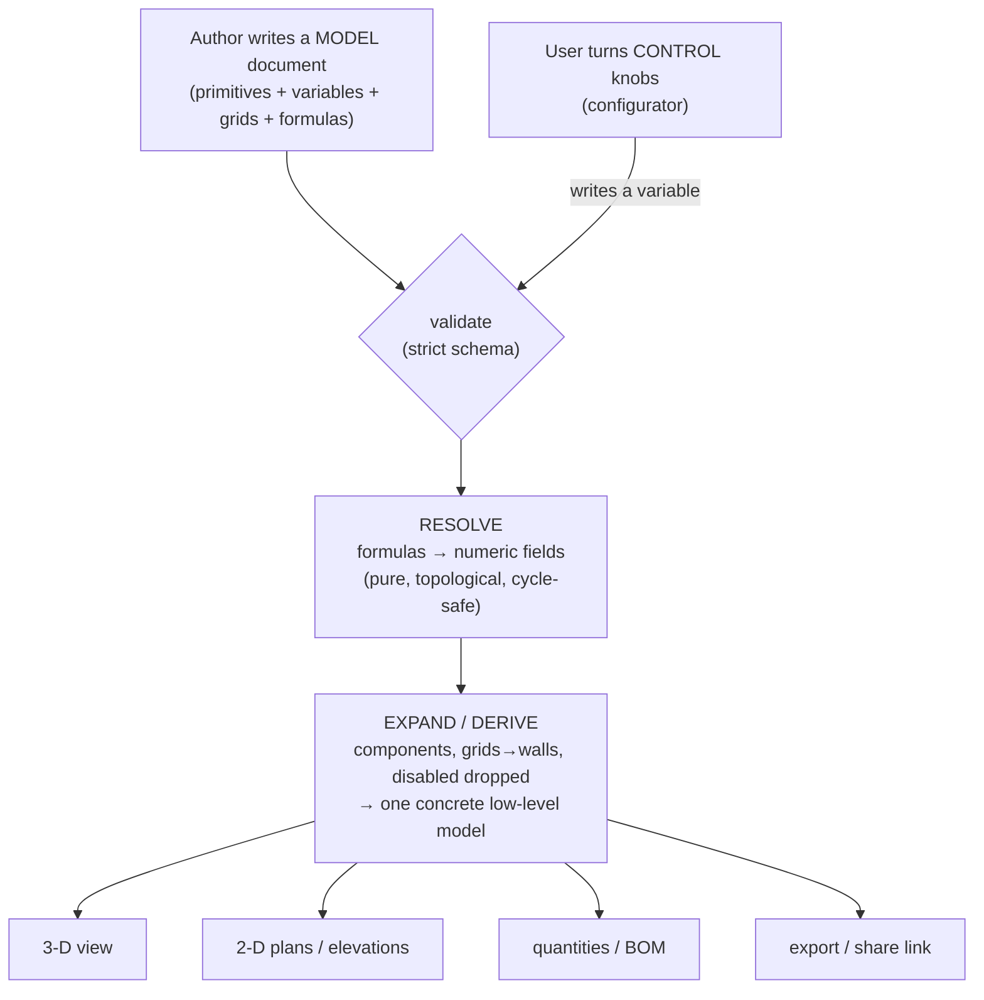
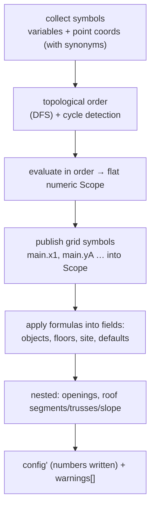

# Building a Parametric Domain-Specific Language

### A reference method, derived from Wadi (parametric house design), for reproducing the same system in any domain

---

## 0. What this document is

This is a **methodology reference**. It describes, in full detail, how Wadi turns
a single declarative document into a live, fully parametric 3‑D house — and then
abstracts that into a **domain-agnostic recipe** you can follow to build an
equivalent system for a completely different domain (a solar farm, a data-centre
floor, a garden, a PCB, a factory line, a slide layout…).

The central claim is that "a parametric design tool" is not one program but a
**stack of clearly separated layers**, each with a single responsibility. If you
reproduce the layers and the contracts between them, you get the same power —
choose-a-design-and-vary-it, author-once-reuse-everywhere, one-model-many-outputs —
regardless of what the primitives actually are.

The document has three parts:

1. **The layered architecture** (§1–§10) — each layer explained with the real
   Wadi mechanics.
2. **The distilled principles** (§11) — the transferable rules, stripped of
   houses.
3. **The recipe + a worked second domain** (§12–§13) — how to apply it to a new
   domain, illustrated end-to-end on a solar-PV farm, with a quick mapping table
   for several more.

Throughout, **"Wadi"** = the concrete case; **"the model"** = the generic idea.

---

## 1. The core idea

A parametric design system is built from three tiers that must not be conflated:

```
        ┌─────────────────────────────────────────────┐
  TIER 3│  CONTROL          knobs a user turns for a    │  "make THIS house
        │  (configurator)   specific instance           │   30ft wide, hip roof"
        ├─────────────────────────────────────────────┤
  TIER 2│  ASSEMBLY         a parametric MODEL: primitives│ "a 3-bay Konkan house
        │  (the document)   composed + related by formulas│  on a grid"
        ├─────────────────────────────────────────────┤
  TIER 1│  VOCABULARY       PRIMITIVES with typed         │ "room, wall, pillar,
        │  (the schema)     parameters                    │  roof, staircase…"
        └─────────────────────────────────────────────┘
```

- **Tier 1 — Vocabulary.** A fixed, small set of *primitives*. Each is a typed
  record: a `type` discriminator plus a flat bag of scalar parameters (and maybe
  a little nested structure). Primitives are the "words".
- **Tier 2 — Assembly.** A *model* is a document that composes primitives and
  wires *relationships* between them with **named variables** and **formulas**.
  This is a "sentence" — a parametric design, not one frozen instance.
- **Tier 3 — Control.** A curated handful of the model's variables are surfaced
  as **control parameters** (sliders, selects, toggles). Turning a knob re-runs
  the relationships and the whole model re-flows. This is "speaking the sentence
  for a particular occasion".

Everything else in this document is the machinery that makes those three tiers
work together: a formula engine, a resolver, reusable components, an expansion
step, multiple renderers, validation, and an extensibility socket.

The full data + control flow:



Each box is a **pure function of the box before it**. That purity is what makes
the whole thing live, testable, and shareable.

---

## 2. The seven layers (map of the rest of the document)

| # | Layer | Responsibility | Wadi file(s) |
|---|-------|----------------|--------------|
| 1 | **Primitives** | the typed vocabulary | `schema/houseConfig.ts` |
| 2 | **Assembly model** | composition, coordinate frame, conventions | the `.wadi` document |
| 3 | **Parametric layer** | variables, points, grids, per-field formulas | `schema` + author data |
| 4 | **Resolver** | formulas → numbers, one directional pass | `param/resolve.ts`, `param/formula.ts` |
| 5 | **Control** | curated knobs + presence switches | `configurator`, `enabled` |
| 6 | **Components** | reusable parametric sub-assemblies | `components`, `component` |
| 7 | **Expansion + renderers** | derive a concrete model; many outputs | `svg2d/expand.ts` + renderers |

Plus three **cross-cutting concerns** (§10): validation & forward-compat, units &
display, and the extensibility **registry**.

---

## 3. Layer 1 — Primitives (the vocabulary)

A primitive is a **self-contained typed record**. In Wadi every object is a member
of a *discriminated union* keyed on `type`:

```ts
object = discriminatedUnion("type", [
  plinth, ground, floor_slab, beam, pillar, wall, room, staircase,
  door, window, kitchen_platform, roof, item, component
])
```

Each carries:

- a **`type`** discriminator (the "part of speech"),
- a flat set of **scalar parameters** — its intrinsic geometry/behaviour,
- optional **nested sub-structures** (e.g. a `wall` has `openings[]`; a `roof`
  has `segments[]`, `slope`, `trusses[]`; a `room` has `walls{}` and `items[]`),
- a few **universal fields** every primitive shares (see below).

### 3.1 The Wadi primitive catalogue

| Primitive | What it is | Key intrinsic parameters |
|-----------|-----------|--------------------------|
| `room` | a rectangular space that grows its own walls | `x, y, width, length, walls{north,south,east,west}, wall_heights, items[]` |
| `wall` | a free-standing wall segment | `start_x, start_y, end_x, end_y, height, height_end, openings[]` |
| `pillar` | a structural column | `x, y, width, length, height` (x,y = **centre**) |
| `beam` | a horizontal member | `x, y, …, height, height_end` |
| `floor_slab` | an RCC deck | `x, y, width, length, thickness` |
| `staircase` | a flight (auto-splits into switchbacks) | `start_x, start_y, step_rise, step_tread, step_width, direction, max_run, rise_height` |
| `roof` | unified segment roof (hip/gable/shed/flat) | `segments[], slope, trusses[], default_endpoint` |
| `door` / `window` (or nested `openings[]`) | a hole cut in a wall | `x, y, width, height, sill_height, direction` |
| `kitchen_platform` | a polyline countertop | `path[], side, depth, height` |
| `plinth` / `ground` | the base / terrain of a floor | `x, y, width, length, height` |
| `item` | a GLB furniture / décor instance | `asset{src, dimensions[w,h,d]}, x, y, rotation, scale` |
| `component` | an **instance** of a reusable sub-assembly | `ref, params{}, x, y, z_offset` |

### 3.2 Universal fields (the primitive "envelope")

Every primitive shares a small envelope that the higher layers rely on:

- **`type`** — the discriminator (how dispatchers route it).
- **`name`** — a human handle (also a reference target, e.g. an opening's
  `room`+`direction`).
- **`formulas`** — *the parametric hook* (§5): `{ fieldName: "= expression" }`.
- **`enabled`** — a *presence switch* (`bool | number`): `false`/`0` removes the
  object from every view. Can be driven by a formula → the basis of optional
  rooms and mutually-exclusive variants.
- **`layer`** — a *visibility* tag (display-only, never geometry).
- **`z_offset`** — placement in the stacking axis relative to the container base.

> **Design rule.** Keep intrinsic geometry as **plain numbers**. Do *not* store a
> formula in a geometry field. Store the number there and the formula beside it in
> `formulas`. The number is always a valid, renderable fallback; the formula is an
> overlay the resolver applies. This keeps every consumer simple (they only ever
> read numbers) and makes the model degrade gracefully.

---

## 4. Layer 2 — The assembly model

### 4.1 It is a single declarative document

The entire design is **one JSON document** (`.wadi` / `house_config.json`) — not
code, not a binary. This one decision buys an enormous amount:

- it is **inspectable, diffable, and version-controllable**;
- it can be **shared in a URL** (Wadi encodes a whole house into a share link);
- it can be **authored by a human, a form UI, or an AI agent** interchangeably;
- it is **serialisable across runtimes** (the same document drove a Python/Blender
  pipeline and now a TypeScript/Three.js one).

### 4.2 The composition container

Primitives don't float free; they live in **containers** that impose stacking and
scoping. In Wadi the container hierarchy is:

```
HouseConfig
 ├─ site           (plot dimensions, reference origin)
 ├─ defaults       (house-wide fallbacks: wall_thickness, floor_height…)
 ├─ variables / points / grids / components   (the parametric layer, §5)
 ├─ configurator   (control metadata, §5.4)
 ├─ layers         (visibility groups)
 └─ floors[]       (ordered; array order == vertical stack)
      └─ objects[] (the primitives on that floor)
```

The **floor** is the assembly unit: it owns an ordered `objects[]` list and its own
overridable heights (`height`, `wall_height`, `slab_thickness`). Array order *is*
the physical stack — reordering floors restacks the building. Your domain's
container might be a *page*, a *layer*, a *stage*, a *rack row* — the principle is
the same: a scoping/stacking bucket that primitives belong to.

### 4.3 The coordinate frame + conventions (critical, easy to get wrong)

A parametric model needs an **unambiguous placement frame** and — this is the
subtle part — **conventions that eliminate arithmetic** for the author.

Wadi's frame: Inkscape-style, origin top-left, **X right, Y down**, a separate
stacking axis for height. But the important idea is the `coord_convention` knob:

- **`"outer"` (legacy):** a room's `x,y,width,length` describe the **outer wall
  face**. Adjacent rooms must *overlap* by a wall thickness — the author does wall
  math constantly.
- **`"center"` (canonical):** the same numbers are **wall centrelines**. Adjacent
  rooms simply *abut* on a shared line; the expansion step grows each footprint by
  `wall_thickness/2` to the outer face. The author never does wall math.

> **Design rule.** Push structure into the *model* so the *author* writes less.
> The centreline convention and the grid (§5.3) exist for exactly one reason: to
> let an author say "this room spans grid line 1 to line 3" and get correct
> geometry without computing a single wall offset. Find your domain's equivalent
> arithmetic tax and design it away.

### 4.4 Units are a first-class, explicit concern

Geometry lives in **abstract "project units"**. A separate `units` block controls
only how numbers are *labelled* on drawings (`feet_inches`, `per_unit: 10`, …).
Geometry never changes with the display unit. Keeping *storage units* and *display
units* orthogonal avoids a whole class of "someone changed the unit and the model
resized" bugs.

---

## 5. Layer 3 — The parametric layer

This is what turns a static document (Tier 1+2) into a *parametric model*. Four
constructs, all optional (absent ⇒ a plain, non-parametric design):

### 5.1 Variables — named scalars

```json
"variables": { "bay": 120, "depth": 300, "wallT": 8, "roof_style": 3 }
```

A variable is `name → number | "= formula"`. Variables may reference each other.
They are the model's **degrees of freedom** — the things a knob will eventually
move.

### 5.2 Points — named 2-D anchors (that double as sizes)

```json
"points": { "House": { "x": "= 3 * bay", "y": "= depth" } }
```

A point is a named coordinate pair. A neat trick: each coordinate is referenceable
under **case-insensitive synonyms** — `House.x / .X / .w / .W` for the first,
`House.y / .Y / .l / .L` for the second — so a single point doubles as both a
*position* and a *rectangle size* (`House.W`, `House.L`) without a second
structure.

### 5.3 Grids — first-class structural scaffolds

The most powerful construct. A grid is a set of **named, ordered centrelines** per
axis (X numbered `1,2,3…`, Y lettered `A,B,C…` by convention), each positioned by a
formula:

```json
"grids": {
  "main": {
    "x": [ {"name":"1","at":0}, {"name":"2","at":"= bay"}, {"name":"3","at":"= 2*bay"} ],
    "y": [ {"name":"A","at":0}, {"name":"B","at":"= depth"} ]
  }
}
```

The resolver **publishes each grid line as a formula symbol**: `main.x1`, `main.x2`,
`main.yA`, …. A room then places itself with ordinary formulas and *no wall math*:

```json
{ "type": "room", "name": "Living", "x": 0, "y": 0, "width": 1, "length": 1,
  "formulas": { "x": "= main.x1", "y": "= main.yA",
                "width": "= main.x3 - main.x1", "length": "= main.yB - main.yA" } }
```

Grids carry per-line **`thickness`** (a "tartan" grid) and a **`role`** tag
(`structural` | `planning`). Because a grid is defined in centrelines, it is
**thickness-independent and reusable** across templates: change the bay spacing and
every room, slab, and column bound to the grid re-flows together.

### 5.4 The per-field `formulas` map — the universal hook

Every container (object, floor, `site`, `defaults`, and even nested openings /
roof segments / truss positions) may carry:

```json
"formulas": { "width": "= main.x3 - main.x1", "enabled": "= 1 - min(1, abs(roof_style - 3))" }
```

The resolver evaluates each entry and **writes the number into the named field**.
The authored number in the field is just a fallback; the formula overlays it.

### 5.5 The formula language

A **deliberately tiny**, safe, side-effect-free arithmetic language — *no `eval`,
no branching, no loops, no I/O*:

```
expr   := term (('+' | '-') term)*
term   := factor (('*' | '/') factor)*
factor := '-' factor | '(' expr ')' | number | call | identifier
call   := name '(' args? ')'          // min, max, clamp, round, floor, ceil, abs
identifier := name ('.' name)*        // dotted: point/grid symbols, e.g. main.x1, House.W
```

- A leading **`=`** marks a string as a formula (the storage convention); it's
  stripped before parsing.
- **Evaluation never throws.** Parse errors, unknown symbols, divide-by-zero →
  `{ value: null, error }`, surfaced as a *warning*, never a crash.
- The engine also extracts a formula's **dependencies** (the symbols it reads),
  which the resolver needs for ordering.

> **Why no `if`/comparisons?** Branching is emulated with arithmetic —
> `enabled = 1 - min(1, abs(roof_style - 3))` is `1` iff `roof_style == 3`, else
> `0`. Keeping the language total (every expression has a value) and branch-free
> makes the dependency graph static and the resolver trivial to reason about.
> Add domain functions (e.g. `min/max/clamp`) rather than control flow.

---

## 6. Layer 4 — The resolver (the engine room)

The resolver is a **pure function `config → config`** that evaluates every formula
and writes the results into fields. Its contract is worth copying verbatim to any
domain:

- **Never throws.** Any unexpected error returns the *original* config plus one
  warning.
- **Fast path.** A model with no variables/points/formulas is returned *by
  reference* — zero cost, no spurious re-render.
- **Idempotent.** Resolving an already-resolved model yields identical numbers.
- **Immutable & minimal.** Same reference is preserved wherever nothing changed,
  so only the parts that actually moved get a new identity (cheap re-rendering).
- **Source-of-truth preservation.** Only *object* numeric fields are written;
  `variables`/`points` keep their authored value (which may be a formula string).

### 6.1 The pipeline



1. **Collect symbols.** Every variable and every point coordinate (under all its
   synonyms) becomes a symbol with a value-or-formula and a dependency list.
2. **Topologically order** the symbols by dependency, using a DFS that marks
   on-stack nodes to **detect cycles** (a circular reference becomes a warning, not
   a hang).
3. **Evaluate** each symbol in order into a flat `Scope: { symbol → number }`.
4. **Publish scaffold symbols.** Resolve each grid's line positions (and per-line
   thickness) and inject `<gridId>.x<name>` / `.y<name>` into the same `Scope`.
5. **Apply formulas into fields.** For every object/floor/`site`/`defaults`,
   evaluate its `formulas` map against `Scope` and write the numbers into the named
   fields. Recurse one level into nested structures that carry their own formulas
   (wall/room **openings**; roof **segments** whose `start_x/start_y/end_x/end_y`
   map *into* coordinate arrays; **truss** `pos<i>` positions; the roof **slope**).
6. Certain fields are semantically integers (`num_steps`, `tie_beam_count`); the
   resolver **rounds** them at the single write point rather than in each consumer.

The dataflow is strictly **one-directional**: `knobs → variables → points → grids →
object fields`. Objects reference the scaffolds, never each other — so objects need
no ordering among themselves, and there is never a constraint-solving fixpoint. It
is a *dataflow spreadsheet*, not a constraint solver — and that is a feature: it is
predictable, fast, and debuggable.

### 6.2 Performance & caching

Because a config is an immutable value that changes identity on every edit, the
resolver caches the built `Scope` in a `WeakMap` keyed on the config object, so
many fields checking their own formula in one render pass share a single scope
build.

---

## 7. Layer 5 — Control parameters (the knobs)

The parametric layer (§5) gives you *many* degrees of freedom. The **control
layer** decides which of them an end user should actually touch, and how.

### 7.1 The configurator — a curated projection of variables

```json
"configurator": {
  "inputs": [
    { "target": "bay",        "label": "Room width", "control": "slider",
      "unit": "ft", "min": 90, "max": 150, "step": 5 },
    { "target": "roof_style", "label": "Roof",       "control": "select",
      "options": [ {"value":0,"label":"Flat"}, {"value":3,"label":"Hip"} ] }
  ]
}
```

Each input **targets a variable** (or a point coordinate via the synonyms) and
declares its presentation (`slider | number | select | toggle`), range, step, and
label. The configurator is **pure metadata**: the resolver and every geometry
consumer *ignore* it. Turning a knob does exactly one thing — **write a number into
a variable** — and then the normal resolve→expand→render pass produces a new model.

> **Design rule.** The set of knobs is an *authored, curated* surface, not the raw
> variable list. The template author (the domain expert) decides what a downstream
> user may vary and within what bounds. This is precisely what lets a non-expert
> safely customise an expert's design.

### 7.2 Presence switches — `enabled`

The second control primitive is the boolean/number **`enabled`** field on every
object, itself formula-drivable. Two idioms fall out of it:

- **Optional parts:** `"formulas": { "enabled": "= has_pooja" }` — a variable
  toggles a whole room in or out; the rest of the model re-flows around it.
- **Mutually-exclusive variants:** four roof objects, each gated
  `"= 1 - min(1, abs(roof_style - N))"`, so exactly one is enabled for a given
  `roof_style`. A `select` knob then swaps whole sub-assemblies with no new code.

Disabled objects are dropped centrally at expansion (§9), so *every* renderer
honours them for free.

---

## 8. Layer 6 — Components (reusable parametric sub-assemblies)

When a domain has repeated sub-assemblies, promote them to **components**: a
component is a *mini-model* stored once and instantiated many times.

- A **definition** (`components: { id → ComponentDef }`) has its own
  `variables` / `points` / `objects`, authored in **local coordinates** (origin
  0,0), and declares which variables are its public **`params`** (label + default).
- An **instance** (`{ "type": "component", "ref": "id", "params": {...}, "x", "y",
  "z_offset" }`) overrides the public params (numbers, or **formulas evaluated in
  the host's scope**) and places the body at an offset.

At expansion the instance is **flattened**: resolve the component with the override
params and origin, recurse (components may nest), then offset every produced object
into the host frame. No renderer ever needs to know `component` exists. This is
ordinary *procedural abstraction* — a parameterised function call — expressed in
data.

---

## 9. Layer 7 — Expansion + renderers (one model, many outputs)

Between the resolved parametric model and the outputs sits **one derivation step**
(`expandRoomWalls`). This is the seam that keeps every renderer simple. In one pass
it:

- grows centreline footprints to outer faces (per `coord_convention`);
- **expands components** into concrete objects;
- expands **multi-flight staircases** into plain flights + landings;
- **trims walls** where pillars overlap;
- anchors **room-nested furniture** to the (possibly resized) room footprint;
- **drops disabled objects** (`enabled=false/0`) so nothing downstream sees them;
- degrades gracefully on bad input (a malformed object is skipped with a warning,
  not a blank model).

The output is a **concrete, low-level model** that every consumer reads:

- **3-D** (`react-three-fiber` / Three.js) — solids, CSG openings, materials;
- **2-D SVG** — floor plans, elevations, roof details, a filtered "layout" sheet;
- **Quantities** — a wall-area / bill-of-materials estimator;
- **Export / share** — GLB, a URL-encoded share link, a native `.wadi` file.

> **Design rule.** Do the hard derivation *once*, centrally, and let every output
> consume the simplified result. Renderers should be near-trivial mappers from the
> concrete model to their medium. If two renderers each re-derive geometry, they
> *will* drift.

---

## 10. Cross-cutting concerns

### 10.1 Validation & forward-compatibility

- The schema is a **strict** typed contract (Zod discriminated unions, optional
  fields, `.strict()` objects). A bad document is rejected with field-level errors,
  not a silent misrender.
- **Additive-optional evolution:** new capabilities are added as *optional* fields,
  so an old document still validates (missing fields take defaults).
- **Tolerant load** for forward-compat: when a document authored by a *newer*
  build carries keys this build doesn't know, the loader iteratively strips exactly
  those `unrecognized_keys` (at any depth) and retries, reporting what it dropped —
  so a newer share link still opens on an older engine, minus the features it can't
  render, instead of hard-failing.

### 10.2 Non-geometry metadata is quarantined

Concerns that must **not** affect geometry live in their own blocks that the
resolver ignores: **`layers`** (visibility groups), **`units`** (display labelling),
**`thumbnails`** (preview snapshots), **`configurator`** (control metadata). Keeping
them out of the geometry path means they can never perturb the model.

### 10.3 The extensibility registry (adding a new primitive)

New primitives plug into a **registry** so you don't edit N dispatchers. A
`NodeDefinition` bundles everything one primitive needs in **one module**:

```ts
interface NodeDefinition {
  type: string;                         // discriminator it handles
  label: string;                        // menu / tree label
  addable?: boolean;                    // offer in "+ Add" menu
  makeDefault?(cfg, existing): Object;  // a sensible new instance
  Form?: Component;                     // property-panel editor
  defaultLayerId?: string | (obj,floor) => string;
  render3D?(obj, ctx): { layerId, node } | null;   // 3-D output
  planFootprint?(obj): { cx, cy, w, d, rot, label } | null;  // 2-D footprint
}
```

Dispatchers (3-D scene, 2-D plan, property panel, add-menu, layers) **consult the
registry first**, falling back to legacy per-type switches. Result: **a new
primitive = one self-contained file**, not a shotgun edit across the renderers.

---

## 11. The principles, distilled

Strip away houses and this is the transferable core:

1. **Three tiers, kept separate:** vocabulary (primitives) ▸ assembly (a
   relational model) ▸ control (curated knobs). Never merge them.
2. **Primitives are typed records:** a `type` discriminator + a flat bag of scalar
   parameters + optional nesting + a shared envelope (`name`, `formulas`,
   `enabled`, `layer`, placement).
3. **The model is a single declarative document,** not code — inspectable,
   diffable, shareable, runtime-agnostic, authorable by human/form/AI alike.
4. **Keep intrinsic fields as plain numbers; attach formulas beside them.** The
   number is always a valid fallback; the formula is an overlay.
5. **A parametric layer over the primitives:** named variables, named anchors
   (points), structural scaffolds (grids), and a per-field formula map.
6. **A tiny, total, side-effect-free formula language:** arithmetic + a few pure
   domain functions, no `eval`, no control flow; emulate branching with math; track
   dependencies.
7. **A resolver that is a pure `model → model` function:** collect symbols →
   topologically order (detect cycles) → evaluate to a flat scope → publish
   scaffold symbols → write numbers into fields. One-directional dataflow, *not* a
   constraint solver. Never throws; fast-path; idempotent; immutable.
8. **Control = a curated projection of variables** into UI knobs (bounds, steps,
   widget), authored by the domain expert. Plus **presence switches** for optional
   and mutually-exclusive parts.
9. **Reusable sub-assemblies as components:** mini-models with public params,
   instantiated with overrides + placement, flattened at expansion. Procedural
   abstraction in data.
10. **One central expansion step → a concrete low-level model → many renderers.**
    Derive once; consumers stay trivial and never drift.
11. **Conventions that delete arithmetic** (centrelines, grids). Push structure
    into the model so authors write intent, not offsets.
12. **Quarantine non-geometry metadata** (visibility, display units, previews,
    control) so it can't perturb geometry.
13. **Evolve additively; load tolerantly.** Optional new fields + strip-unknown on
    load = forward/backward compatibility for shared documents.
14. **Extensibility via a registry:** one new primitive = one module that declares
    how it is created, edited, and rendered.

---

## 12. The recipe — applying the method to a new domain

Work top-down through these steps. Each maps to a Wadi layer.

**Step 1 — Enumerate the primitives.** List the irreducible parts of a design in
your domain. For each: choose a `type` name, list its intrinsic scalar parameters,
note any nested sub-structure, and mark which fields are *authored* vs *derived*.

**Step 2 — Fix the placement frame + conventions.** Define the coordinate/stacking
frame and the meaning of position/size. Then find the arithmetic your authors would
otherwise repeat and design a *convention* (like centrelines) or a *scaffold* (like
grids) to delete it.

**Step 3 — Define the assembly container.** Choose the scoping/stacking bucket
(floor / page / stage / row) and how buckets order.

**Step 4 — Serialise as one strict document.** Pick JSON; write a strict,
discriminated, optional-friendly schema. This is your wire format and source of
truth.

**Step 5 — Add the parametric layer.** Add `variables`, named `points`/anchors, any
`grids`/scaffolds, and a per-field `formulas` map on every container.

**Step 6 — Implement the formula engine.** Arithmetic + your domain's pure
functions; leading-`=` convention; dependency extraction; never throws.

**Step 7 — Implement the resolver.** Collect symbols → topo-order (cycle-detect) →
evaluate to a flat scope → publish scaffold symbols → write fields; fast-path,
immutable, idempotent, warning-not-exception.

**Step 8 — Choose control parameters.** Expose a curated subset of variables as a
`configurator` (widget, bounds, step, label). Add `enabled` presence switches for
optional and variant parts.

**Step 9 — Add components** if the domain repeats sub-assemblies.

**Step 10 — Implement one expansion step → a concrete model → your renderers/
exporters.** Derive once; keep outputs trivial.

**Step 11 — Add a registry** so new primitives are one module.

**Step 12 — Add validation, tolerant load, and quarantined metadata** (visibility,
units, previews).

---

## 13. Worked second domain — a parametric **solar-PV farm**

To show the method is domain-agnostic, here is the same architecture applied to
utility-scale solar. Nothing about houses carries over except the *structure*.

**Step 1 — Primitives.**

| Primitive | Intrinsic parameters |
|-----------|----------------------|
| `panel` | `w, h, wattage` |
| `table` (a rack of panels) | `panels_x, panels_y, tilt, x, y` |
| `inverter` | `x, y, rated_kw` |
| `combiner_box` | `x, y, inputs` |
| `cable_run` | `path[], gauge` |
| `access_road` | `path[], width` |
| `block` (component) | a reusable pod of `table`×N + one `inverter` |

Each gets the same envelope: `type, name, formulas, enabled, layer`.

**Step 2 — Frame + convention.** Ground plane, X east / Y north, metres. The
"arithmetic tax" here is **row pitch vs. ground-coverage ratio (GCR)** — authors
shouldn't hand-place every row. So introduce a **field grid** whose lines *are* the
row and column centrelines.

**Step 3 — Container.** A `sections[]` array (fenced parcels), analogous to floors.

**Steps 4–5 — Document + parametric layer:**

```json
{
  "variables": {
    "plot_w": 20000, "plot_d": 12000,
    "gcr": 40,                         // ground-coverage ratio, %
    "table_len": 340,                  // one table, cm
    "row_pitch": "= table_len * 100 / gcr",
    "n_rows": "= floor(plot_d / row_pitch)",
    "target_kw": 5000
  },
  "grids": {
    "field": {
      "x": [ {"name":"C1","at":0}, {"name":"C2","at":"= table_len"}, {"name":"C3","at":"= 2*table_len"} ],
      "y": [ {"name":"R1","at":0}, {"name":"R2","at":"= row_pitch"}, {"name":"R3","at":"= 2*row_pitch"} ]
    }
  },
  "configurator": {
    "inputs": [
      { "target": "gcr",       "label": "Ground coverage", "control": "slider", "unit": "percent", "min": 30, "max": 55, "step": 1 },
      { "target": "target_kw", "label": "Target capacity",  "control": "number", "unit": "count" }
    ]
  },
  "sections": [
    { "name": "Array A", "objects": [
      { "type": "table", "name": "T-R1C1", "x": 0, "y": 0, "panels_x": 4, "panels_y": 2, "tilt": 20,
        "formulas": { "x": "= field.xC1", "y": "= field.yR1" } },
      { "type": "table", "name": "T-R2C1", "x": 0, "y": 0, "panels_x": 4, "panels_y": 2, "tilt": 20,
        "formulas": { "x": "= field.xC1", "y": "= field.yR2" } },
      { "type": "inverter", "name": "INV-1", "x": 0, "y": 0, "rated_kw": 1250,
        "formulas": { "enabled": "= 1 - min(1, abs(0 - 0))" } }
    ] }
  ]
}
```

**Step 6–7 — Formula engine + resolver:** *identical* to Wadi's. `field.yR2`
resolves to the row-2 centreline; every table binds to a grid node and re-flows when
`gcr` changes (which changes `row_pitch`, which moves every `R*` line).

**Step 8 — Control:** the two knobs above. Dragging **Ground coverage** re-pitches
every row live; **Target capacity** could gate whole `block` components on via
`enabled` formulas (add tables until `n_tables * table_kw ≥ target_kw`).

**Step 9 — Components:** a `block` = tables + inverter, instantiated per parcel with
param overrides — exactly Wadi's `component`.

**Step 10 — Expansion + outputs:** one expansion (grid → table positions, disabled
dropped, blocks flattened) feeds: a 3-D site view, a 2-D layout drawing, a
**quantities** output (panel count, cable length, projected kW — the domain's
"bill of materials"), and a share link.

### 13.1 The mapping is mechanical

| Generic role | Wadi (houses) | Solar PV farm | Data-centre floor | Garden design |
|---|---|---|---|---|
| Primitive | room, wall, roof | table, inverter | rack, CRAC, PDU | bed, path, tree |
| Container | floor | section/parcel | room / row | zone |
| Scaffold (grid) | bay/axis grid | row × column pitch | floor-tile grid | plot grid |
| Key variables | bay, depth, roof_style | gcr, target_kw | rack_count, redundancy | sun_exposure, bed_w |
| Control knobs | plot size, roof, rooms | GCR, capacity | racks, N+1 vs 2N | sunlight, spacing |
| Component | stair pod, bay | array block | cooling pod | planting module |
| Presence switch | optional pooja room | spare string | redundant CRAC | seasonal bed |
| Expansion output | plans, 3-D, quantities | layout, kW, cable BOM | rack elevation, kW/cooling load | plan, plant list |

Every column is the *same seven layers* with different nouns. That is the whole
point: **the architecture is the reusable asset, not the primitives.**

---

## 14. Anti-patterns (things this method deliberately avoids)

- **A constraint solver.** Bidirectional constraints ("keep these two walls
  aligned") need a fixpoint engine, are slow, and fail unpredictably. One-directional
  dataflow (spreadsheet, not solver) is predictable and fast. If you truly need a
  constraint, model it as a formula that computes one side from the other.
- **Formulas that reference other objects.** Objects reference *scaffolds*
  (variables/points/grids), never each other, so there is no inter-object ordering.
  Shared quantities live in a variable both objects read.
- **`eval` / a Turing-complete embedded language.** A total, branch-free arithmetic
  language keeps the dependency graph static and the model safe to share.
- **Re-deriving geometry in each renderer.** Derive once at expansion; consumers map
  the concrete model. Two derivations drift.
- **Letting display concerns touch geometry.** Units, layers, colours, previews are
  quarantined metadata the resolver ignores.
- **Editing N dispatchers to add a primitive.** Use a registry; one primitive = one
  module.

---

## 15. One-paragraph summary

Model any design domain as a **small typed vocabulary of primitives**, composed
into a **single declarative document**, made parametric by a layer of **named
variables, anchors, and grids wired through a tiny safe formula language**, and
collapsed into concrete geometry by a **pure, one-directional, cycle-safe resolver**
followed by a **single expansion step** that feeds **many trivial renderers**.
Expose a **curated subset of the variables as control knobs**, gate optional parts
with **presence switches**, factor repetition into **reusable components**, keep
non-geometry concerns **quarantined**, evolve the schema **additively** and load
**tolerantly**, and make the whole thing extensible through a **registry**. Do that,
and "choose a design and vary it for your use case" works in any domain — because
the reusable asset is the architecture, not the house.
```